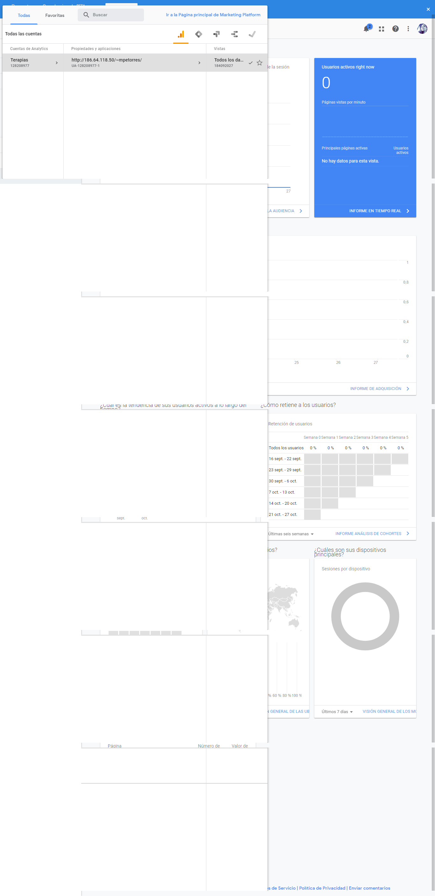
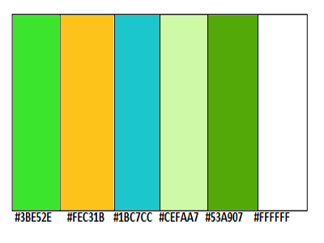
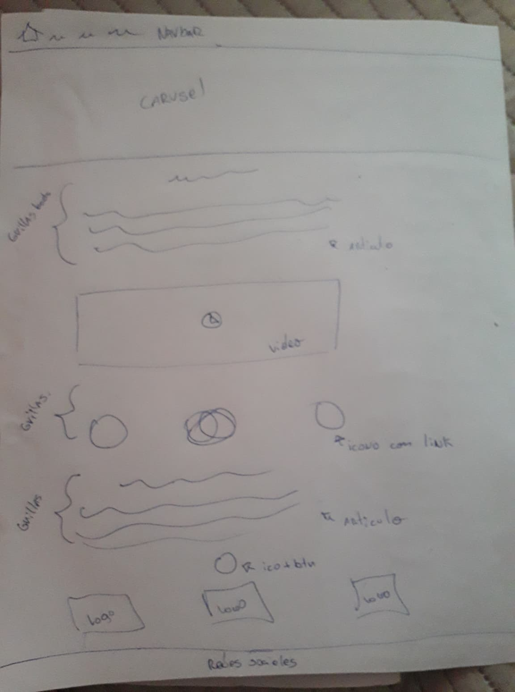
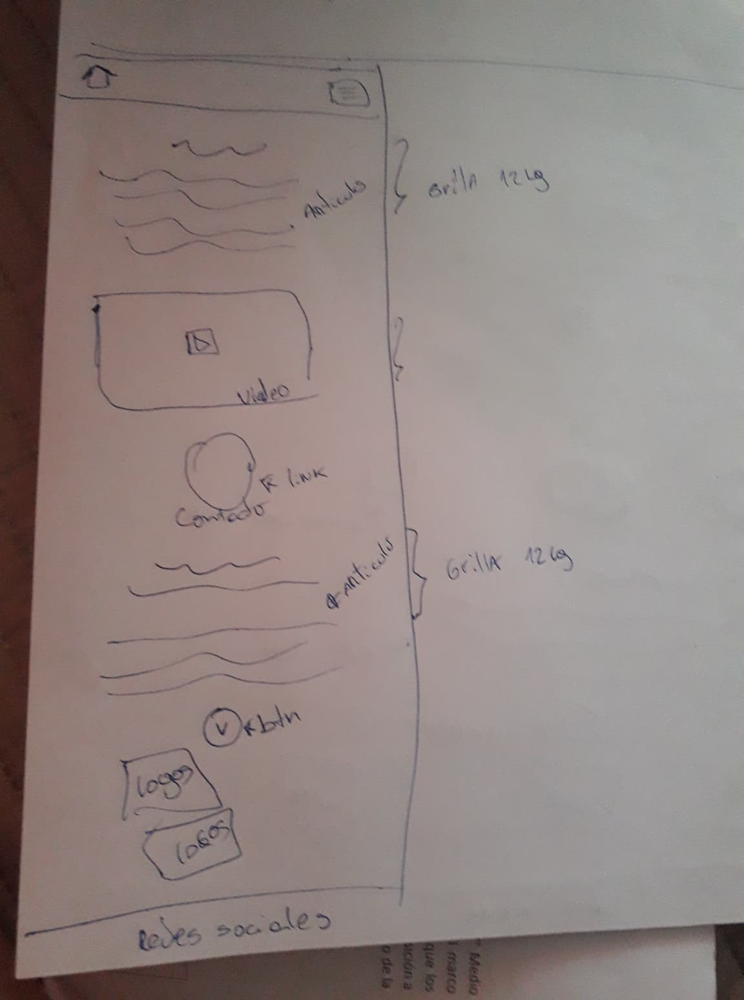
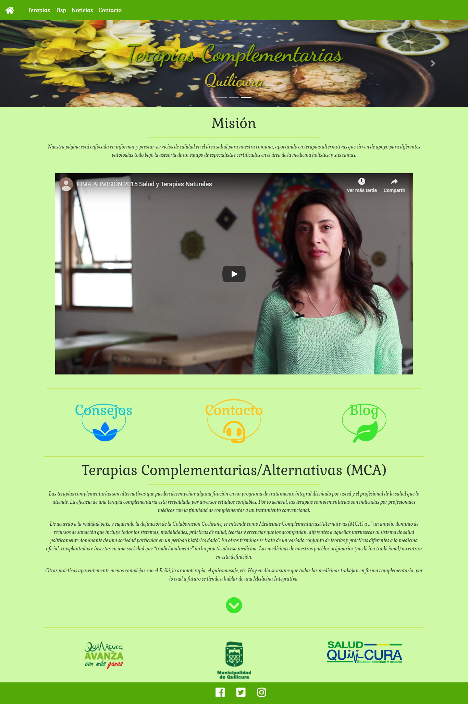
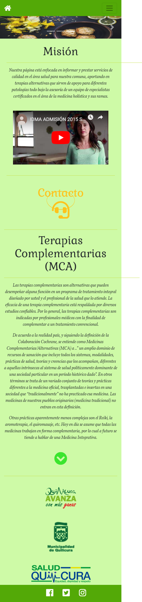

# Tema seleccionado Página web de Vida Sana en la comuna

Terapias alternativas y productos Naturales

## Los objetivos para la interfaz (ui) y para la experiencia del usuario (ux):

###ux:

La página estará enfocada para toda la familia, será una ayuda práctica para informar de manera certera sobre las nuevas tendencias en salud respaldado por un equipo profesional. Tomando en cuenta que existe poca información, lugares de venta establecidos donde encontrar productos de calidad  y certificados dentro de nuestra comuna, daremos  toda la información posible en nuestro sitio, además de consejos prácticos, como también, información de profesionales y centros terapéuticos dentro de Quilicura.
Para lograr esto el usuario tendrá una navegación fácil de realizar donde los accesos a sitios de interés incluirá imágenes grandes con una breve referencia de cada terapia, podrá realizar compras online y consultas a diversos profesionales. Además, tips  de alimentación, agendar citas con terapeutas, todo esto al alcance de un click.
Su contenido será en colores vivos agradables a la vista,  con letras e iconos grandes pensados para todo tipo de usuarios, con la finalidad que los usuarios encuentren de forma fácil y rápida lo que buscan y consideren volver a la página por nueva información.
La versión móvil dará énfasis a mostrar nuestro footer con redes sociales ya que es un publico mas jóvenes quienes mas navegan en móviles y trendrá acceso fácil a las redes sociales, manteniendo los artículos y video explicativo .

###ui: 

La página será responsiva, tipo blog, con un navbar de 4 link (Terapias, blog, noticias y contacto), tendrá un icono al costado derecho que llevara al inicio de la página.
Nuestra main se divide en 2 artículos, para los cuales se utilizarán grillas de bootstrap,en medio se mostraran 3 link de acceso rápido a consejos,noticias y blog donde se mostrara información relevante sobre las terapias y nuestros terapeutas. El footer tendrá 3 iconos que llevan directo a nuestras redes sociales.
La versión móvil mantendrá sus artículos, video informativo y solo se mantendrá  link  de contacto,
En el  navbar los link estarán contenidos en una hamburguesa sacada de bootstrap. La main está conformada por  grillas responsivas para que se distribuyan correctamente al tamaño móvil, dicha grilla será de tamaño S y se realizará en  nuestra página con estilo propio en CSS. En su footer mantendrá los iconos de las redes sociales en tamaño rem para que se ajuste a la resolución de la ventana del navegador además se agrego "position fixed" para que este siempre este visible.
Además en su versión para wordpress se agrega google analitycs para el seguimiento de nuestro sitio junto a plugins de contacto y google map.
 

###Paleta de Colores

###Tipografía sacada de google fonts

- títulos: Galada
- Navbar : Song Myung
- párrafos: Song Myung 

##Los requerimientos del sitio:

##La definición de layout:

El layout será  tipo blog, con 1 columna, donde se muestran 2 artículos, un video explicativo y 3 botones en el centro que llevan de forma rápida a: consejos,noticias y blog . 

##Sketch

Versión Escritorio

Versión móvil

##Mockup

home realizado con HTML, CSS, Bootstrap

proyecto final

http://186.64.118.50/~mpetorres/

usuario:admin

clave:HE6WP%kdLBoy*HUY